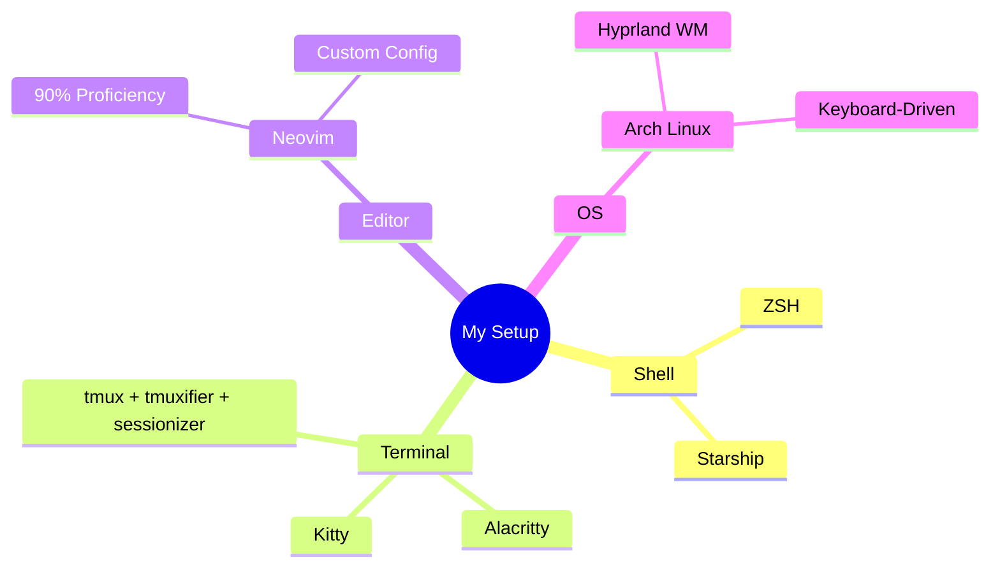
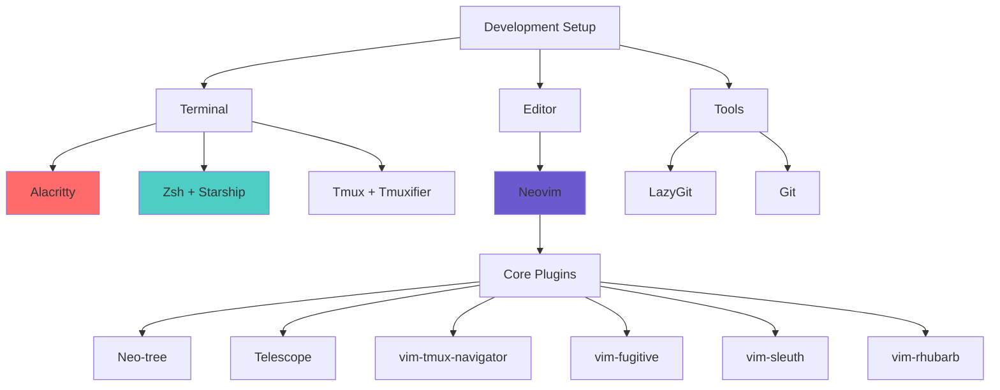

# 👋 Hi, I'm Santosh Shrestha

<div align="center">
  
  
  [](https://github.com/SantoshShrestha11/dotfiles)
</div>

## 🚀 Development Environment



## 💻 Tech Journey

```rust
/// Current Status: Exploring Systems Programming
struct TechStack {
    primary_langs: ["Rust 🦀", "C"],
    web_stack: ["HTML", "CSS", "JavaScript(Soon)"],
    tools: ["Git", "Docker(Soon)", "NixOS(On Hold)", "Nix(On Hold)"],
    editor: "Neovim + Custom Plugins",
}
```

## 🎯 Current Focus

<div align="center">
  


</div>

```text
📚 Learning Progress
════════════════════════════════════
Rust           ██████░░░░░░  49%
C Programming  ████████░░░░  62%
Web Dev        ██████░░░░░░  HTML/CSS/Tailwind CSS
Python         █████████░░░  30% (On Hold)
Django         ██░░░░░░░░░░  14% (On Hold)
Docker         ██░░░░░░░░░░  Starting Soon
NixOS          ███░░░░░░░░░  29% (On Hold)
Nix            █████░░░░░░░  46% (On Hold)
```

## ⚡ Workflow Highlights

- **Terminal Setup**: Alacritty + Kitty + Zsh + Starship + tmux
- **Productivity**:
  ```shell
  # Daily tmuxifier session
  tmuxifier load-session getting-rusty
  ```
- **Browser**: Vim keybindings for keyboard-driven navigation
- **Version Control**: Git integrated into daily workflow

## 🔧 Projects & Contributions

```text
Current Focus:
════════════════════════════════════
🦀 Rust Projects
📁 Dotfiles Maintenance
🌐 Web Development Foundations
🐧 Linux System Customization
```

<div align="center">
  


[](https://github.com/ashutosh00710/github-readme-activity-graph)

</div>

## 🤝 Connect With Me

<div align="center">
  
[](https://github.com/SantoshShrestha11)
[](mailto:santoshshresthasantoshshrestha@gmail.com)

</div>

---

<div align="center">
  
  
  
  
</div># 👋 Hi, I'm Santosh Shrestha
<div align="center">
  
</div>

## 🛠️ Development Arsenal



## 💻 Daily Driver

```lua
-- Current Setup Configuration
local setup = {
    terminal = "Alacritty + Kitty",
    shell = "Zsh + Starship",
    editor = "Neovim",
    os = "Arch Linux + Hyprland",
    workflow = {
        navigation = "tmux-navigator",
        file_explorer = "neo-tree",
        fuzzy_finder = "telescope",
        git_client = "lazygit",
        git_integration = {"fugitive", "rhubarb"}
    }
}
```

## 🎯 Focus Areas

<div align="center">
  


</div>

```rust
// Current Learning Path
struct LearningJourney {
    primary: ["Rust 🦀", "Systems Programming in C"],
    tools: ["Neovim Configuration", "Terminal Workflow"],
    upcoming: ["Docker", "JavaScript"],
    web: ["HTML", "CSS"],
}
```

## ⚡ Workflow Snapshot

```bash
# My typical dev session
tmux new-session -s dev
├── nvim src/        # Code editing with Neovim
├── lazygit         # Git operations
└── cargo watch -x run  # Rust development
```

<div align="center">
  
[](https://git.io/streak-stats)
[](https://github.com/ashutosh00710/github-readme-activity-graph)

</div>

## 🔧 Tech Stack Progress

```text
Tool Proficiency:
════════════════════════════════════
Tmux        ████████████  98%
Neovim      ██████████░░  90%
Rust        ██████░░░░░░  49%
Git         ███████████░  92%
Terminal    █████████░░░  85%
```

<div align="center">
  
  
  
  
</div>
